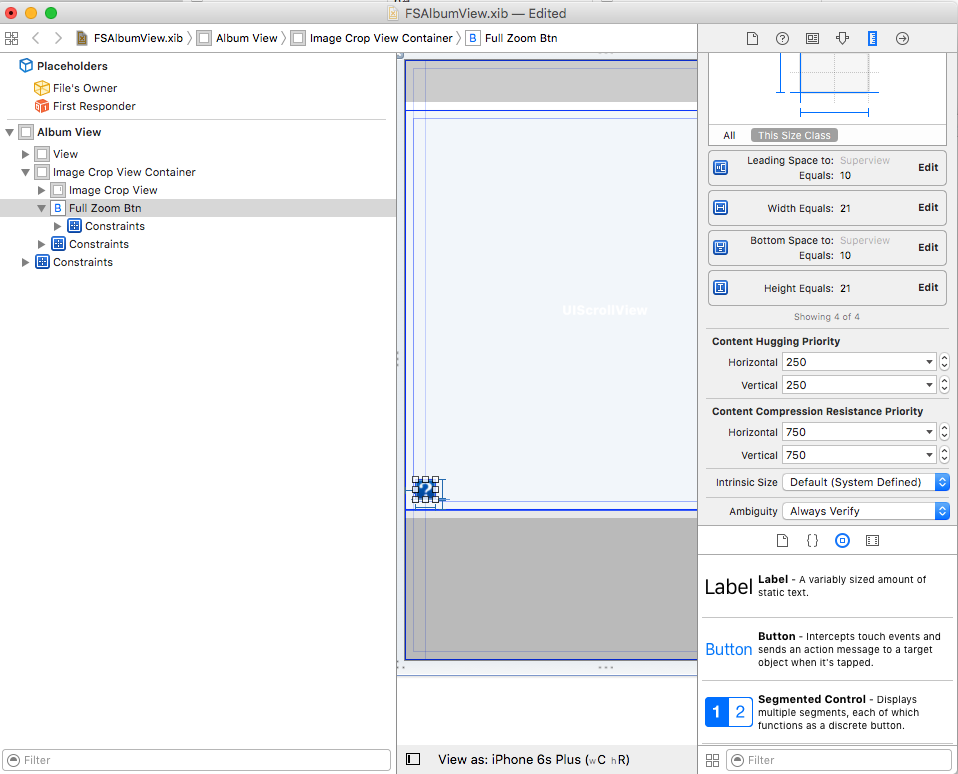

# Fusuma UPDATE방법
1. fusumaviewcontroller xib 수정
	* 상태 바 고려하여 top을 20정도 둔다! (메뉴, 카메라, 라이브러리)
	* **이때, 절대 update frame을 하지 않는다! 하면 다 망가짐**
	
2. FSAlbumView xib 파일에서 1:1버튼을 만든다
 	
 	
3. FSImageCropView, FSAlbumView 수정

 	
 	